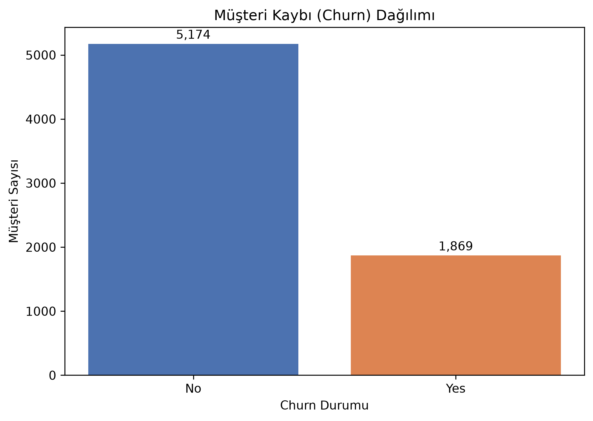
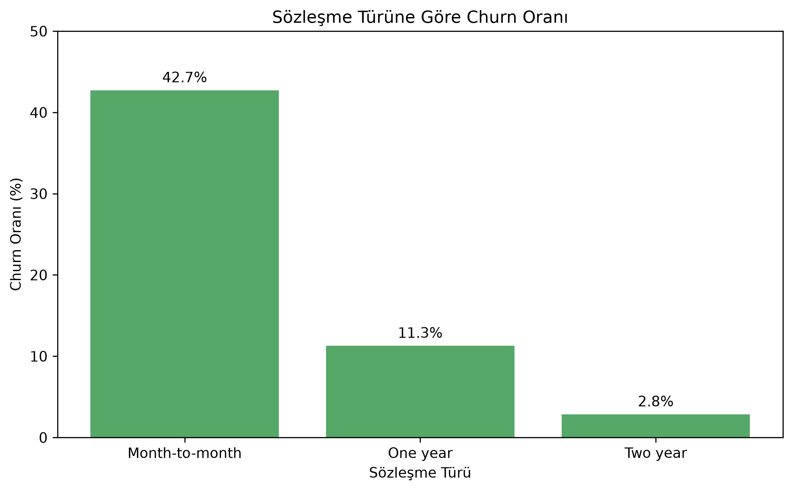
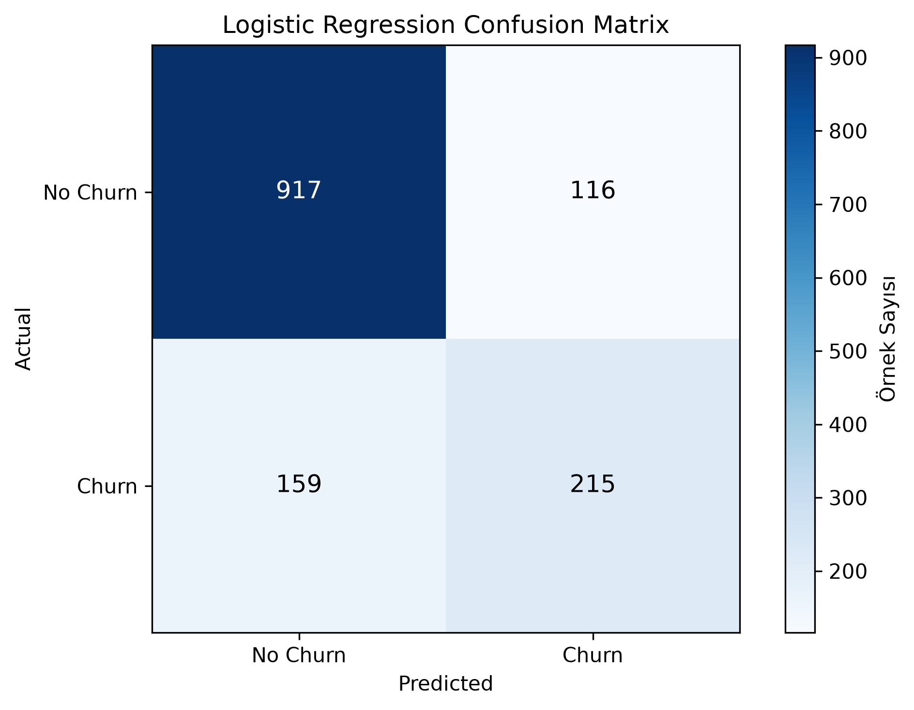

# Customer Churn Analysis

Bu bootcamp projesi, bir telekomünikasyon şirketinin müşterilerinin hizmetten ayrılıp ayrılmayacağını (`Churn`) incelemektedir. Amaç; müşteri, hizmet, abonelik ve ödeme bilgilerini kullanarak churn davranışını anlamak ve temel bir sınıflandırma modeli kurmaktır.

## Proje Hakkında

Customer churn, müşterinin bir hizmeti kullanmayı bırakmasıdır. Projede önce veri yapısı ve churn ile ilişkili gözlenen farklılıklar incelenmiş, ardından veri modellemeye hazırlanarak Logistic Regression ile değerlendirilmiştir.

## Veri Seti

Veri seti, [IBM Telco Customer Churn](https://github.com/IBM/telco-customer-churn-on-icp4d/blob/d5371f5d83a446ad5673cbcca3b814b926491f8a/data/Telco-Customer-Churn.csv) veri setidir.

- Ham veri boyutu: **7.043 satır × 21 sütun**
- Her satır bir müşteriyi temsil eder.
- Ön işleme sırasında `TotalCharges` sütununda yalnızca boşluk içeren 11 problemli kayıt çıkarılmıştır. Modelleme verisi 7.032 satırdan oluşur.

## Projede Yapılanlar

- Exploratory Data Analysis
- Data Visualization
- Data Preprocessing
- Logistic Regression
- Model Evaluation

## Temel Bulgular

- Aylık sözleşme grubunda churn oranı %42,71 iken bir yıllık sözleşmede %11,27, iki yıllık sözleşmede %2,83'tür.
- Churn eden müşterilerin medyan müşteri süresi 10 ay, churn etmeyenlerin ise 38 aydır.
- Churn eden müşterilerin medyan aylık ücreti 79,65; churn etmeyenlerin medyanı 64,43'tür.
- Fiber optic internet hizmeti (%41,89) ve Electronic check ödeme yöntemi (%45,29) gruplarında daha yüksek churn oranları gözlenmiştir.

Bu bulgular veri setindeki gözlenen ilişkileri gösterir; neden-sonuç ilişkisi kurmaz.

## Model Sonuçları

Logistic Regression, test setinde majority-class baseline'ından daha iyi sonuç vermiştir.

| Metrik | Sonuç |
| --- | ---: |
| Accuracy | %80,45 |
| Majority-class baseline accuracy | %73,42 |
| Churn precision | %64,95 |
| Churn recall | %57,49 |
| Churn F1-score | %60,99 |

Model, testteki 374 gerçek churn müşterisinin 215'ini doğru tahmin etmiş; 159 müşteriyi false negative olarak kaçırmıştır. Bu nedenle sınıflar tam dengeli olmadığından accuracy tek başına yeterli bir değerlendirme değildir.

## Görseller







## Medium Makalesi

Bootcamp final çalışması **Makine Öğrenmesi ile Müşteri Kaybı Tahmini: Customer Churn Analizi** başlığıyla Medium'da yayımlandı: [Medium'da makaleyi oku](https://medium.com/@bbarisrkt/makine-%C3%B6%C4%9Frenmesi-ile-m%C3%BC%C5%9Fteri-kayb%C4%B1-tahmini-customer-churn-analizi-90a97ae6bf05).

## Proje Yapısı

```text
customer-churn-analysis/
├── customer_churn_analysis.ipynb
├── data/
│   └── Telco-Customer-Churn.csv
├── medium_article.md
├── outputs/
│   └── figures/
├── README.md
└── requirements.txt
```

## Teknolojiler

- Python
- pandas
- NumPy
- Matplotlib
- Seaborn
- scikit-learn
- Jupyter Notebook

## Gereksinimler

- Python 3.12 veya üzeri (`requirements.txt` içindeki `numpy==2.5.2` Python 3.12+ gerektirir; 3.12 ile doğrulandı)
- `requirements.txt` içindeki sabit sürümler: pandas 3.0.5, numpy 2.5.2, matplotlib 3.11.1, seaborn 0.13.2, scikit-learn 1.9.0, jupyter 1.1.1

## Kurulum

```bash
git clone https://github.com/barissurkit/customer-churn-analysis.git
cd customer-churn-analysis
python -m venv .venv
source .venv/bin/activate   # Windows: .venv\Scripts\activate
pip install -r requirements.txt
```

## Kullanım

Not defterini repository'nin kök dizininden açın (veriyi `data/Telco-Customer-Churn.csv` yolundan okur):

```bash
jupyter notebook customer_churn_analysis.ipynb
```

Tüm hücreler çalıştırıldığında (Kernel > Restart & Run All) grafikler `outputs/figures/` dizinine kaydedilir ve model değerlendirme hücreleri şu sonuçları verir:

```text
Veri setinin boyutu: 7043 satır × 21 sütun
Accuracy: 0.8045 (%80.45)
```

## Testler

```bash
pip install pytest
pytest tests
```

Testler veri setinin yapısını doğrular ve not defterindeki tüm kod hücrelerini geçici bir dizinde çalıştırarak README'deki sonuçları (7.032 satırlık modelleme verisi, %80,45 accuracy, %73,42 baseline, confusion matrix) yeniden üretir.

## Katkı

Katkı rehberi için [CONTRIBUTING.md](CONTRIBUTING.md) dosyasına bakın.

## Lisans

[MIT](LICENSE)
