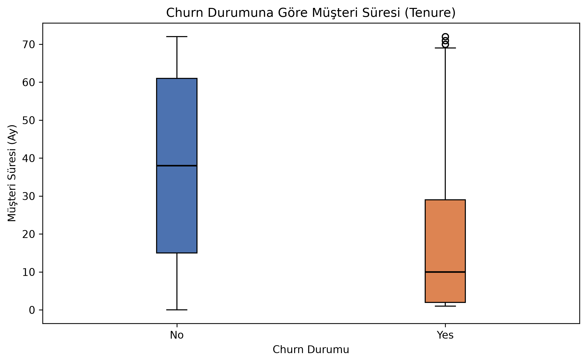

# Makine Öğrenmesi ile Müşteri Kaybı Tahmini: Customer Churn Analizi

## Customer Churn Nedir?

Bir müşterinin bir hizmeti kullanmayı bırakması, yani *customer churn* (müşteri kaybı), özellikle abonelik modeliyle çalışan şirketler için önemli bir konudur. Bir müşteri ayrıldığında yalnızca mevcut gelir kaybolmaz; yeni müşteri kazanmak için de ek zaman ve maliyet gerekebilir. Bu nedenle müşterilerin ayrılma eğilimlerini erken fark edebilmek, müşteri ilişkileri açısından anlamlı bir başlangıç noktası olabilir.

Bu bootcamp projesinde bir telekomünikasyon şirketinin müşteri verilerini inceleyerek churn davranışını anlamaya çalıştım. Süreç; Keşifsel Veri Analizi (*Exploratory Data Analysis — EDA*), görselleştirme, veri ön işleme ve Logistic Regression ile temel model değerlendirmesi adımlarından oluştu. Amaç, kusursuz bir tahmin sistemi kurmaktan çok gerçek bir veri bilimi akışını baştan sona uygulamaktı.

## Veri Seti: IBM Telco Customer Churn

Projede [IBM Telco Customer Churn](https://github.com/IBM/telco-customer-churn-on-icp4d/blob/d5371f5d83a446ad5673cbcca3b814b926491f8a/data/Telco-Customer-Churn.csv) veri setini kullandım. Veri seti 7.043 müşteriye ve 21 sütuna sahip. Her satır bir müşteriyi temsil ediyor.

Değişkenler tek tek bakıldığında oldukça fazla görünebilir; ancak temel olarak dört grupta düşünülebilir:

- Müşteri bilgileri: cinsiyet, partner ve bakmakla yükümlü olunan kişi bilgileri gibi alanlar.
- Hizmet bilgileri: telefon, internet, güvenlik, yedekleme ve yayın hizmetleri.
- Abonelik ve ödeme bilgileri: müşteri süresi (*tenure*), sözleşme türü, aylık ücret, toplam ücret ve ödeme yöntemi.
- Hedef değişken: `Churn`. Yes, müşterinin ayrıldığını; No, hizmete devam ettiğini gösteriyor.

Bu yapı, hem müşteri profilini hem de kullanılan hizmetler ile ödeme tercihlerinin churn ile nasıl ilişkili göründüğünü incelemeye imkân veriyor.

## İlk Bakış: Churn Dağılımı

EDA'nın ilk adımında hedef değişkenin dağılımına baktım. Veri setinde 5.174 müşteri (%73,46) churn etmemiş, 1.869 müşteri (%26,54) ise churn etmiş durumda.

<!-- MEDIUM: Buraya churn_distribution.png görselini yükle -->

*Şekil 1 — Veri setindeki churn dağılımı.*

Bu dağılım sınıfların tamamen dengeli olmadığını gösteriyor. Bu yüzden model sonucunu yalnızca accuracy ile değerlendirmek yeterli olmayabilir. Model, çoğunlukta olan No Churn sınıfını daha sık tahmin ederek yüksek görünen bir accuracy elde edebilir. Bu nedenle ileride precision, recall ve F1-score değerlerine de bakmak gerekiyor.

## Görselleştirmelerle Gözlenen Farklılıklar

### Sözleşme türü

Sözleşme türüne göre churn oranları belirgin biçimde farklılaştı. Aylık sözleşmesi (*Month-to-month*) olan müşterilerde churn oranı %42,7 iken bir yıllık sözleşmede %11,3, iki yıllık sözleşmede ise %2,8 olarak gözlendi.

<!-- MEDIUM: Buraya contract_churn.png görselini yükle -->

*Şekil 2 — Sözleşme türüne göre churn oranı.*

Bu sonuç, bu veri setinde aylık sözleşme grubunda daha yüksek bir churn oranı bulunduğunu gösteriyor. Ancak buradan sözleşme türünün tek başına churn'e neden olduğu sonucu çıkarılamaz. Müşterilerin ihtiyaçları, hizmet tercihleri veya başka değişkenler de bu farkla ilişkili olabilir.

### Müşteri süresi ve aylık ücret

Müşteri süresi, yani `tenure`, churn ile birlikte öne çıkan değişkenlerden biri oldu. Churn eden müşterilerin medyan müşteri süresi 10 ayken churn etmeyen müşterilerde bu değer 38 ay.

<!-- MEDIUM: Buraya tenure_churn.png görselini yükle -->

*Şekil 3 — Churn durumuna göre tenure dağılımı.*

Grafikte de churn eden grubun daha düşük sürelerde yoğunlaştığı görülüyor. Benzer şekilde `MonthlyCharges` dağılımında churn eden müşterilerin medyan aylık ücreti 79,65, churn etmeyenlerin medyanı ise 64,43. Dağılımlar kısmen örtüşse de, churn eden grubun aylık ücret merkezinin daha yüksek olduğu gözleniyor.

İnternet hizmeti ve ödeme yöntemi de incelenen diğer alanlardı. Fiber optic kullanan grupta churn oranı %41,9 ile daha yüksek görünürken DSL grubunda bu oran %19,0, internet hizmeti olmayan grupta %7,4 oldu. Ödeme yöntemlerinde Electronic check kullanan müşterilerde oran %45,3; diğer üç ödeme yönteminde ise %15,2 ile %19,1 arasında gözlendi. Bunlar veri setindeki ilişkileri özetler; doğrudan neden-sonuç açıklaması değildir.

## Veri Ön İşleme: Modeli Hazırlamak

Model kurmadan önce veri setini makine öğrenmesi için uygun bir yapıya getirdim. Bu aşamadaki en önemli veri kalitesi konusu `TotalCharges` sütunuydu. Toplam ücret bilgisini taşıyan bu sütun metin tipindeydi ve içinde yalnızca boşluk bulunan 11 kayıt vardı. Sayısal dönüşümden sonra bu 11 kayıt eksik değer olarak göründü.

Bu satırlar toplam veri setinin küçük bir bölümünü oluşturduğu ve toplam ücret bilgisini güvenilir biçimde doldurmak için ek veri olmadığı için çıkarıldı. Böylece modelleme verisi 7.043 satırdan 7.032 satıra düştü. Ham CSV dosyası değiştirilmedi; işlemler veri setinin kopyası üzerinde yapıldı.

Sonraki adımlar şöyleydi:

- Her müşteri için benzersiz olan `customerID` modelleme verisinden çıkarıldı.
- `Churn` hedefi No → 0 ve Yes → 1 biçiminde sayısallaştırıldı.
- Kategorik değişkenler one-hot encoding ile 0/1 sütunlarına dönüştürüldü.
- Dönüşümün sonunda toplam 45 özellik elde edildi.
- Veri, %80 eğitim ve %20 test kümesi olarak ayrıldı; `stratify=y` ile iki kümedeki churn oranlarının benzer kalması hedeflendi.
- `tenure`, `MonthlyCharges` ve `TotalCharges` sütunları `StandardScaler` ile ölçeklendirildi.

Ölçekleyicinin yalnızca eğitim verisi üzerinde `fit` edilmesi özellikle önemliydi. Test verisinin istatistikleri eğitim sürecine karışsaydı veri sızıntısı (*data leakage*) oluşabilirdi. Bu nedenle test setine yalnızca eğitim setinden öğrenilen dönüşüm uygulandı.

## Logistic Regression ile Başlangıç Modeli

Model olarak `LogisticRegression(max_iter=1000, random_state=42)` kullandım. Logistic Regression, iki sınıflı problemler için anlaşılır ve yaygın bir başlangıç modeli. Bu projede hedef değişkenin iki sonucu olduğu için (0 ve 1) uygun bir temel yaklaşım sağladı.

Model yalnızca eğitim verisindeki (`X_train` ve `y_train`) örnekler üzerinden öğrenildi; performansı daha önce görmediği test seti üzerinde ölçüldü. Bu ayrım, modelin eğitim verisini ezberlemek yerine yeni veride nasıl davrandığını değerlendirmek için gerekli.

## Model Sonuçları

Test setindeki temel sonuçlar aşağıdaki gibi oldu:

- **Accuracy:** %80,45
- **Majority-class baseline accuracy:** %73,42
- **Churn Precision:** %64,95
- **Churn Recall:** %57,49
- **Churn F1-score:** %60,99

Confusion matrix, modelin tahminlerini daha ayrıntılı okumayı sağlıyor:

<!-- MEDIUM: Buraya confusion_matrix.png görselini yükle -->

*Şekil 4 — Logistic Regression confusion matrix.*

- True Negative (TN): 917
- False Positive (FP): 116
- False Negative (FN): 159
- True Positive (TP): 215

Test setinde 374 gerçek churn müşterisi vardı. Model bu müşterilerin 215 tanesini doğru biçimde churn olarak tahmin etti; 159 müşteriyi ise No Churn olarak tahmin ederek kaçırdı. Bu yanlış negatifler (*false negative*), gerçekten ayrılabilecek bir müşterinin model tarafından fark edilmemesi anlamına geliyor. Bir müşteri elde tutma çalışmasında bu tür bir tahmin, potansiyel bir iletişim fırsatının kaçırılması olarak yorumlanabilir; yine de bu proje ticari bir karar sistemi kurmayı değil, model sonuçlarını temel düzeyde değerlendirmeyi amaçlıyor.

Accuracy, tüm test örneklerindeki doğru tahmin oranını gösteriyor. Precision, modelin churn dediği müşterilerin ne kadarının gerçekten churn ettiğini; recall ise gerçekten churn eden müşterilerin ne kadarını yakalayabildiğini anlatıyor. F1-score da precision ile recall arasındaki dengeyi tek bir değerde özetliyor.

Bu problemde recall ayrıca önemli. Çünkü churn edecek bir müşterinin gözden kaçması, müşteriyi elde tutma fırsatının kaçırılmasına karşılık gelebilir. Modelin recall değeri %57,49 olduğu için gerçek churn müşterilerinin tamamını yakalayamadığı açıkça görülüyor. Bu nedenle %80,45 accuracy değerini tek başına yeterli kabul etmek doğru olmaz.

## Baseline ile Karşılaştırma

Modelin gerçekten anlamlı bir katkı sağlayıp sağlamadığını görmek için basit bir baseline da hesapladım. Test setindeki herkese No Churn denilseydi accuracy %73,42 olacaktı. Logistic Regression ise %80,45 accuracy elde etti.

Aradaki fark, raporlanan iki ondalık değer üzerinden yaklaşık 7,03 yüzde puanı. Bu fark, modelin yalnızca çoğunluk sınıfını tahmin etmekten daha iyi bir sonuç verdiğini gösteriyor. Yine de baseline'ı geçmek, modelin tüm churn müşterilerini yakaladığı anlamına gelmiyor; confusion matrix ve recall değeri bu sınırı açıkça gösteriyor.

## Sonuç

Bu projede veri analizi ve görselleştirme ile churn davranışı hakkında çeşitli farklılıklar gözlemledim. Sözleşme türü, müşteri süresi, aylık ücret, internet hizmeti ve ödeme yöntemi gruplarında farklı churn oranları görüldü. Logistic Regression, çoğunluk sınıfını tahmin eden baseline'dan daha iyi bir başlangıç sonucu verdi.

Bununla birlikte model bütün churn müşterilerini yakalayamadı. Özellikle 159 false negative değerinin bulunması, recall tarafında iyileştirme alanı olduğunu gösteriyor. İleride farklı modeller veya yöntemler denenerek bu sonuçlar geliştirilebilir; ancak bu çalışmada amaç temel ve anlaşılır bir makine öğrenmesi sürecini tamamlamaktı.

## Bu Projede Neler Öğrendim?

Bu proje boyunca gerçek bir veri setini baştan sona inceleme fırsatı buldum. Veri kalitesi kontrolünde standart eksik değerlerin yanında yalnızca boşluk içeren değerlerin de sorun oluşturabileceğini gördüm. EDA ve görselleştirmelerin, model kurmadan önce veriyi ve olası ilişkileri anlamayı kolaylaştırdığını deneyimledim.

Ayrıca kategorik verileri one-hot encoding ile dönüştürmeyi, train/test split kullanmayı ve `StandardScaler`'ın eğitim verisinde `fit` edilmesinin veri sızıntısını önlemedeki rolünü uyguladım. Logistic Regression, classification metrics ve confusion matrix ile yalnızca accuracy değerine bakmanın sınırlı kaldığını daha net gördüm. Bu adımlar, sonraki veri bilimi çalışmalarım için sağlam bir temel oluşturdu.

## Proje

Notebook, veri seti ve üretilen grafiklere GitHub üzerinden ulaşabilirsiniz:

[github.com/barissurkit/customer-churn-analysis](https://github.com/barissurkit/customer-churn-analysis)

<!-- MEDIUM TAGS: Machine Learning, Data Science, Python, Logistic Regression, Data Analysis -->
